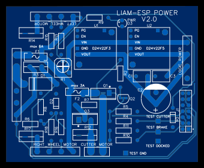
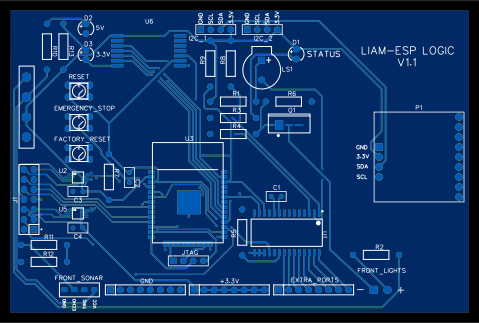

# Liam mower - electronic schematics and PCB

After testing a bunch of different electronic CAD systems I ended up using the web based [EasyEDA](https://easyeda.com/editor) suite, it's easy to get started with, have lots of community provided parts/libraries and requires no installation.

The files in this folder are exports of the schematics and printed circuit boards (PCB) created on EasyEDA for this project, in the future I may make the files public available but for now you could import these files into your own account.

Currently this project consists of two different boards, the "Power board" and the "Logic board". The associated docking station has its own project and files, please se the [Liam-dockingstation project](https://github.com/trycoon/liam-dockingstation) for more information.

## Power board

### Overview

The power board is located in the motor and battery compartment in the lawn mower (rear part). It maintains the connection with the battery and charging circuitry, the motor drivers, the main power switch and fuses. It also contains DC/DC voltage converters that delivers the power to the mowers Logic board and sensors. Since this is the most power hungry part of the board, the PCB-traces are quite wide to be able to support the high current needed by the motors during high load.

**PLEASE NOTE!**  
**Always disconnect battery and remove mower from charing station when working with the mower to prevent shock hazard! Respect the width of the wires/traces, don't try to use thinner wires or oversized fuses because that could overheat mower and start a fire!**

When creating a PCB from these schematics please note that to keep the width of the PCB traces small you need to create the PCB with **2 oz of copper thickness**. Provided that this copper thickness is used then the PCB-board should be able to handle 8.5 Ampere of total current. The cutter motor has traces that support 8.5 Ampere and the wheel motors supports about 6 Ampere. See [PCB Trace Width Calculator](http://circuitcalculator.com/wordpress/2006/01/31/pcb-trace-width-calculator/)

Power board PCB:

<a href="schematic/liam-power-sch.pdf">Circuit diagram</a>

### Assembly & Testing

1. Start by mount and solder the resistors (variable ones included) and diodes (including LED).
2. Mount and solder fuses and connector blocks / headers.
3. Connect a fully charged battery to "Bat+" and "Bat-" terminals and bridge the "Power switch" terminals with a piece of electric wire.
4. Use a voltmeter to verify that there are 14 volt between the wheel motors "VCC" and "GND" terminals, and between the "Bat V" and "GND" terminals at the "LOGIC_POWER" connector.
5. DISCONNECT BATTERY!
6. Mount and solder the DC/DC converters, capacitors and remaining components.
7. Reconnect battery to power up the board.
8. Verify that LED light up to signal that board is powered, if not then disconnect battery and check soldering and components.
9. Use a voltmeter to verify that there are 3.3 volt between the "3.3V" and "GND" terminals at the "LOGIC_POWER" connector.
10. Use a voltmeter to verify that there are 5 volt between the "5V" and "GND" terminals at the "LOGIC_POWER" connector.
11. Measure voltage between "BATTERY_LEVEL" on "J1"-connector and "GND", adjust variable resistor "R1" until voltmeter reads about 1V. Then slowly adjust "R1" until it just reaches 2.0V. THIS MUST BE DONE WITH A FULLY CHARGED BATTERY!
12. To test cutter motor, FIRST MAKE SURE THE CUTTER BLADES IS NOT MOUNTED ON DISC! This could result in severe injuries or material damages!
13. Take a thin wire and connect to a "3.3v" terminal and then touch the other end to the "TEST_CUTTER"-pad, the cutter motor should spin as long as the wire is connected.
14. While cutter motor is spinning, move test-wire from "TEST_CUTTER"-pad to the "TEST_BRAKE"-pad, to test brake functionality of the cutter. The cutter disc should stop much more quickly when brake is applied than if not. NOTE: NEVER CONNECT "TEST_CUTTER" AND "TEST_BRAKE" AT THE SAME TIME! That will damage the circuits.
15. To test docked detection, connect a voltmeter between the "TEST_DOCKED" and "TEST_GND"-pins, it should first measure 0 volts, then place the mower in the docking station (that must be powered), the voltmeter should now report 3.3 volts.
16. Test left wheel motor by connecting the "PWM"-terminal to a "3.3v"-terminal.
17. Test right wheel motor by connecting the "PWM"-terminal to a "3.3v"-terminal.

## Logic board

### Overview

The Logic board is located in the front part of the mower (away from noisy motors) and contains the "brain and sensors" of the mower. The board contains the main CPU, Gyroscope circuit, Ultrasound obstacle detector, GPS-tracker, Docking station communication abilities and more.

Because of the small footprint of all IC-circuits it's better to let a professional PCB factory manufacture this board, it more reliable this way. The quite small power requirements of this board makes the PCB-traces a lot thinner than the Power board, most PCB traces supports up to 1.2 Ampere using a copper thickness of only **1 oz**.

Logic board PCB:

<a href="schematic/liam-logic-sch.pdf">Circuit diagram</a>

### Assembly & Testing

1. Start by mount and solder the resistors, LED and buttons.
2. Mount and solder connector blocks / headers.
3. Connect the four-pin power terminal to the Liam Power board and turn power on.
4. Verify that "5v" and "3.3v" LEDs are light up.
5. Use a voltmeter to verify that there are 3.3 volt between "3.3V" and "GND" terminals on the power connector.
6. Use a voltmeter to verify that there are 5 volt between "5V" and "GND" terminals on the power connector.
7. Use a voltmeter to verify that there are the same amount of voltage across the battery as between "V Bat" and "GND" terminals on the power connector.
8. DISCONNECT Power board!
9. Mount and solder the capacitors, IC and remaining components.
10. Reconnect Power board and turn power on.
11. Verify that LEDs light up and touch components to see if any one feels hot on touch.
12. Connect "J1" connector (make sure it is mounted the right way)

## GPIO pins used on ESP32

There are lots of features in the mower that each needs its own GPIO (General Purpose Input/Output) pin.
To keep track of which pin is used for what, we have made the following table, "Usage" describe the functionality within the mower.

| GPIO | Input            | Output | Usage                     | Notes                                             |
| ---- | ---------------- | ------ | ------------------------- | ------------------------------------------------- |
| 0    | Pulled up        | OK     | Factory reset             | debug output at boot                              |
| 1    | TX pin           | OK     | Debug and upload firmware | debug output at boot                              |
| 2    | Pulled down      | OK     | Cutter PWM                | connected to on-board LED                         |
| 3    | OK               | RX pin | Debug and upload firmware | HIGH at boot                                      |
| 4    | OK               | OK     | Cutter brake              |                                                   |
| 5    | OK               | OK     | LORA-SS                   | outputs PWM at boot                               |
| 6    | -                | -      | -                         | connected to the integrated SPI flash             |
| 7    | -                | -      | -                         | connected to the integrated SPI flash             |
| 8    | -                | -      | -                         | connected to the integrated SPI flash             |
| 9    | -                | -      | -                         | connected to the integrated SPI flash             |
| 10   | -                | -      | -                         | connected to the integrated SPI flash             |
| 11   | -                | -      | -                         | connected to the integrated SPI flash             |
| 12   | OK               | OK     | JTAG-TDI                  | boot fail if pulled HIGH                          |
| 13   | OK               | OK     | JTAG-TCK                  |                                                   |
| 14   | OK               | OK     | JTAG-TMS                  | outputs PWM at boot                               |
| 15   | OK               | OK     | JTAG-TDO                  | outputs PWM at boot                               |
| 16   | OK               | OK     | Sonar front ping          |                                                   |
| 17   | OK               | OK     | LORA-DIO0                 | LoRa interrupt #1                                 |
| 18   | OK               | OK     | LORA-SCK                  |                                                   |
| 19   | OK               | OK     | LORA-MISO                 |                                                   |
| 21   | OK               | OK     | I2C-SDA                   |                                                   |
| 22   | OK               | OK     | I2C-SCL                   |                                                   |
| 23   | OK               | OK     | LORA-MOSI                 |                                                   |
| 25   | OK               | OK     | Left wheel dir            |                                                   |
| 26   | OK               | OK     | Right wheel dir           |                                                   |
| 27   | OK               | OK     | Left wheel PWM            |                                                   |
| 32   | OK               | OK     | Right wheel PWM           |                                                   |
| 33   | OK               | OK     | LORA-DIO1                 | LoRa interrupt #2                                 |
| 34   | OK               | -      | MCP23017 interrupt        | input only, requires resistor for pullup/pulldown |
| 35   | OK               | -      | Docked detection          | input only, requires resistor for pullup/pulldown |
| 36   | OK ("SENSOR_VP") | -      | Emergency stop            | input only, requires resistor for pullup/pulldown |
| 39   | OK ("SENSOR_VN") | -      | Sonar front sense         | input only, requires resistor for pullup/pulldown |

Note! If making any changes to pin-configuration, then make corresponding changes to the [definitions.cpp](../src/definitions.cpp)-file!

## Digital I/O expander

The ESP32 has lots of I/O-pins, but still there never seems to be enough. We have tried to put the most important stuff directly on the ESP32, like PWM-signal and interrupt pins, and let less important and time critical features be available using a 16-bit I/O-expander card connected to the I2C-bus. See the [MCP23017](MCP23017.pdf) datasheet and the [io_digital.cpp](../src/io_digital.cpp)-class.

## Analog-to-Digital converters

Like digital I/O pins there are not enough pins for analog signals, therefore we use the popular 4-channel 16-bit ADS1115 analog-to-digital converter. The ADS1115 also offers better linearity, higher precision and higher sensitivity then the built-in ADC of the ESP32. See [datasheets](ADS1115.pdf) and the [io_analog.cpp](../src/io_analog.cpp)-class.

## Radio connection between mower and docking station

See [LoRa-radio](lora-radio.md)

## Motors

For wheel and cutter motors, see [motors](motors.md)

## Battery

For suitable batteries, see [battery](battery.md)

## Global Navigation Satellite System (GNSS)

This mower navigate by using satellites, for information about suitable GNSS modules, see [gnss](gnss.md)
