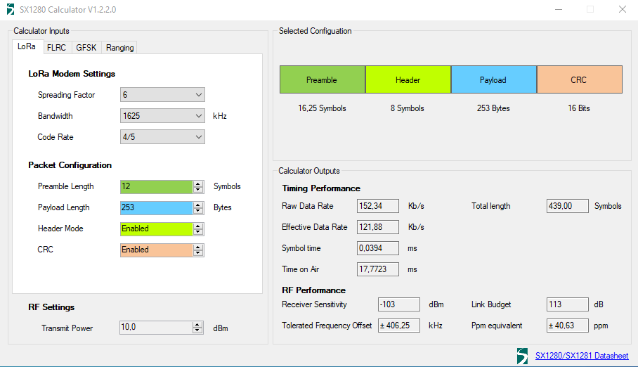

# LoRa

LoRa (Long Range) is a radio modulation technique owned and developed by the Semtech company. They develop the popular [SX12\*\* radio modems](https://www.semtech.com/lora/lora-products) that offers a very long range (several kilometers) radio transmission, but with a very low bitrate (20-200 Kbps).

We use two LoRa modems, one in the mower and the other in the docking station. They are used for relaying request from the clients through the docking station to the mower, and for reporting mower status back to docking station and the clients. LoRa offers connections over a greater distance with higher reliability than ordinary WiFi (IEEE 802.11), making it ideal for mowers in larger gardens.

We use the [E28-2G4M12S](E28-2G4M12S_Usermanual_EN_v1.5.pdf) modules (that are based upon a [SX1280](DS_SX1280-1-2_V3.0.pdf) modem) mainly because they offer a higher bitrate (up to 200 Kbps) and have no duty-cycle restrictions compared to the more popular SX1278 modems.

NEVER START A MODEM WITHOUT THE ANTENNA CONNECTED (it will damage the modem)!

E28-2G4M12S (SX1280) communication settings:

# Communication protocol

TBD
